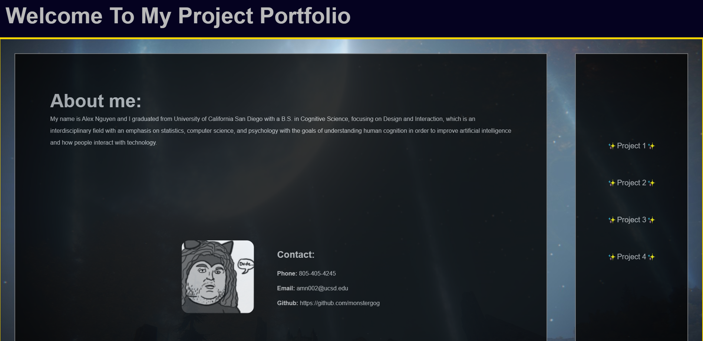

# <AlexNguyenPortfolio>

## Description
A portfolio created so that I can showcase projects that I have worked on so that it can be referenced for myself as well as
potential employers.

## Installation

Once the repo has been downloaded, you can open the webpage by clicking on the index.html file

## Usage

https://monstergog.github.io/portfolio/

Open the webpage and you read about me and find my contact information. If you wish to view projects that I have worked on, you can navigate to their links and screenshots by clicking on one of the projects marked with ✨.

## License

N/A